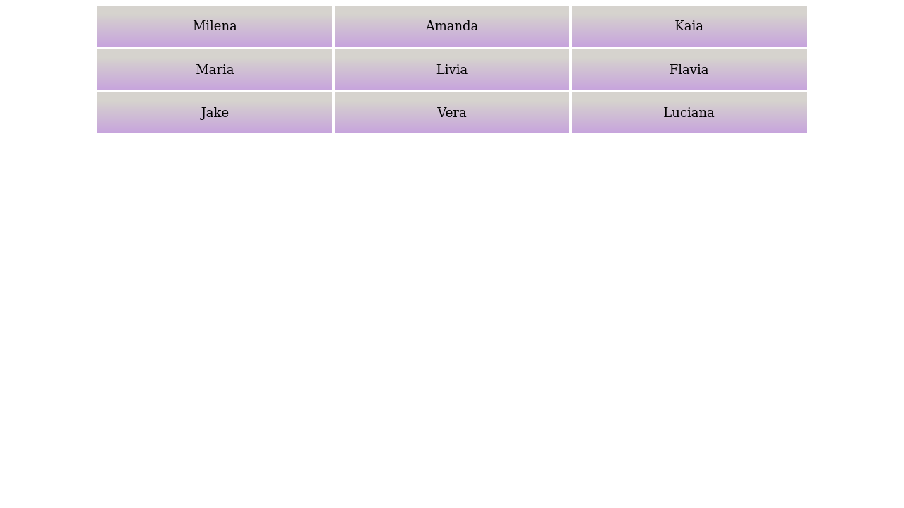
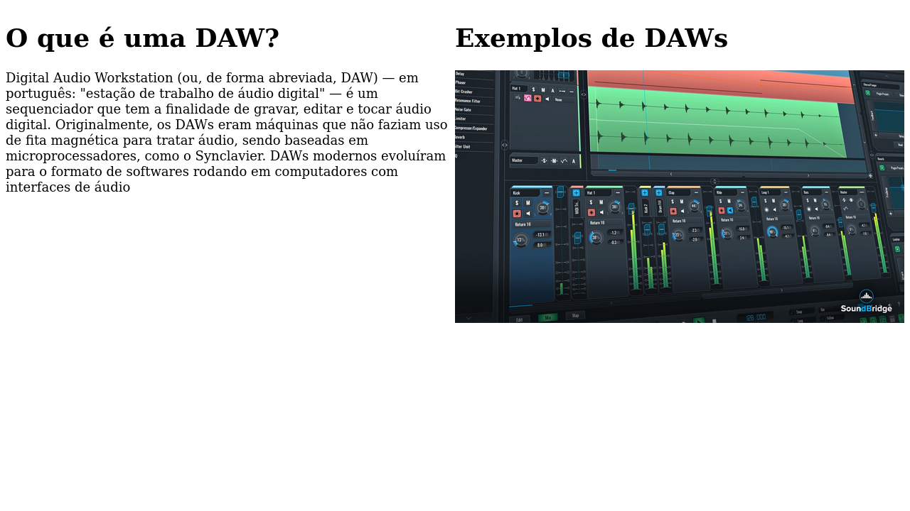
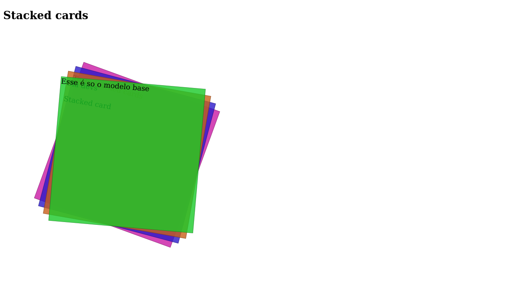
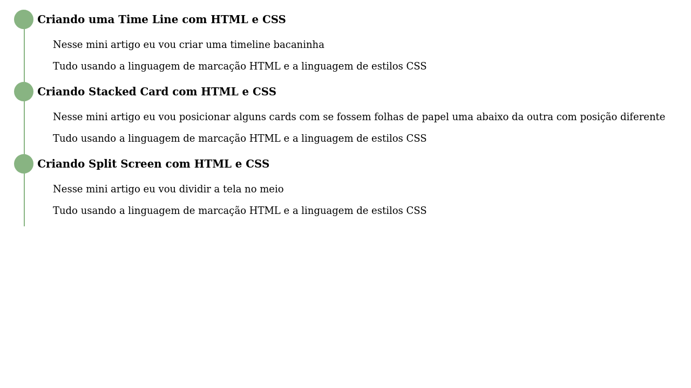

# Treinando CSS

Nesse projeto eu crio várias situações isoladas das partes que compõem um <strong>Layout</strong> tudo usando apenas `HTML` e `CSS`. Pôs o foco é treinar o CSS de forma simples.

### CSS:
- <strong>Card Layout</strong> forma de destribuir Cards na tela
- <strong>Split Screen</strong> forma simples para dividir a tela em duas ou mais partes
- <strong>Stacked Cards</strong> aqui eu posiciono alguns Cards como ser fossem folhas de papel empilhadas uma abaixo da outra 
- <strong>Sticky Header</strong> essa é uma forma de criar um menu que fica fixo mesmo quando iniciamos a rolagem da tela
- <strong>Time Line</strong> Aqui eu crio uma Time Line que nada mais é que um circolo ligado por uma linha reta e o texto fica ao lado é muito bacana isso kkk

### Card Layout 

### Split Screen

### Stacked Cards 

### Sticky Header

### Time Line

### Links

[CSS Layout](https://csslayout.io/) esse é o site que serviu de base para esse projeto.
[CSS - MDN Web Docs](https://developer.mozilla.org/pt-BR/docs/Web/CSS) Site muito bom para consultas ou para aprenser CSS
[W3C - Cascading Style Sheets](https://www.w3.org/Style/CSS/#specs) Site da `W3C` comas especificações para o `CSS`
[W3 Schools](https://www.w3schools.com/Css/) site muito legal com tutoriais para quem quer aprender CSS 